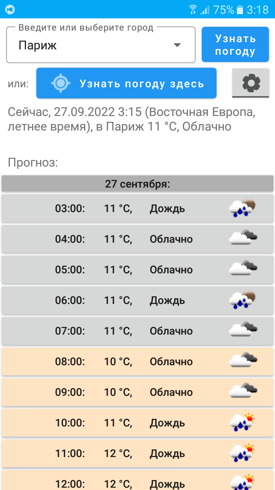

# Weather

Тестовая программа “Прогноз погоды”
Программа изначально была написана на Java с использованием OkHttpClient и GSON. Погода запрашивается на openweathermap.org. Так как программа учебная, бесплатный ключ к Weather API лежит прямо в коде.

Далее Java-код был автоматически конвертирован в Kotlin средствами Android Studio.
Дальнейшее развитие можно посмотреть в истории коммитов. Вот краткое описание.

 - Вместо OkHttpClient был использован Ktor. Изначально всё собиралось, но не заработало. При этом отладку провести было невозможно (в старых версиях kotlinx-coroutines-core невозможна отладка внутри корутин). Пришлось повысить версию kotlinx-coroutines-core, но тогда перестал работать ktor.

    Пришлось долго подбирать такие версии пакетов kotlinx-coroutines-core и ktor, которые не конфликтуют друг с другом, и только когда всё заработало. Парсинг JSON был тоже переложен на плечи ktor (с помощью install(JsonFeature)).

 - Далее вывод прогноза погоды был реализован в виде карточек-кнопок. 
 - Добавлена подгрузка иконок соответствующей погоды для кнопок (с помощью AsyncTask)
 - Было реализовано кеширование ранее подгруженных иконок.
 - Добавлено сохранение настроек, а именно города, для которого запрашивается погода.
 - Отдельное внимание уделено часовым поясам, можно выбрать либо местный часовой пояс, либо часовой пояс города, для которого запрашивается погода (они могут не совпадать).
 - Добавлено запоминание всех запрашивавшихся городов в список, а также выбор города из списка.
 - Добавлена анимация появления карточек с погодой.
 - Добавлено получение координат текущего места (через LocationManager), и запрос погоды для этих координат.
 - Добавлен русский язык интерфейса.

Внешний вид программы не закончен. TODO:
1. Скрытие настроек, например вынесение их в отдельную вкладку;
2. Ручное переключение языков (сейчас язык устанавливает Android в соответствии с системным языком);
3. Использование ListView и адаптеров вместо кнопок.

Web-версию программы можно посмотреть здесь:
https://skivvvvy.gitlab.io/weather/